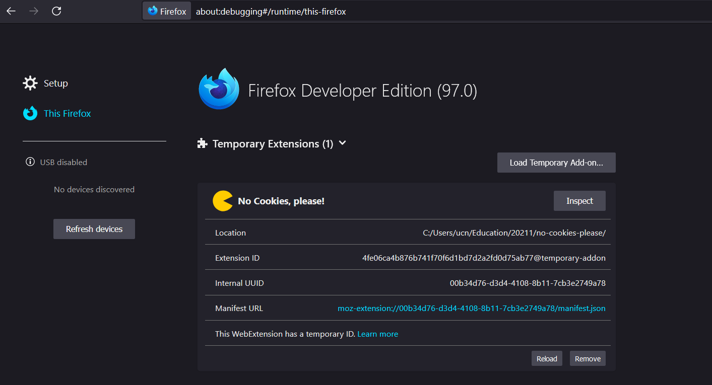
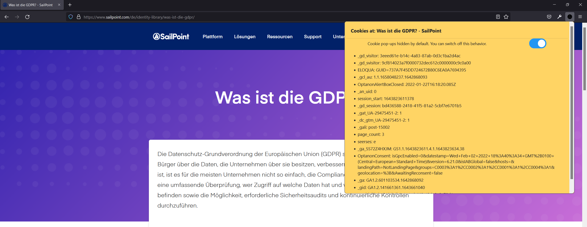

# No Cookies, please!

Firefox add-on to block cookie consent pop-ups. The add-on also have functionality to list the cookies used by the active Firefox tab.

## Installing

In Firefox: Open the [about:debugging page](https://developer.mozilla.org/en-US/docs/Tools/about:debugging), click the This Firefox option, click the Load Temporary Add-on button, then select any file in your extension's directory.

With the Load Temporary Add-on button you can temporarily load a web extension from a directory on disk. Click the button, navigate to the directory containing the add-on and select its manifest file. The temporary extension is then displayed under the Temporary Extensions header.

You don't have to package or sign the extension before loading it, and it stays installed until you restart Firefox.

Once you have loaded a temporary extension, you can see information about it and perform operations on it.

Alternatively, you can run the extension from the command line using the [web-ext](https://extensionworkshop.com/documentation/develop/getting-started-with-web-ext/) tool.

## Testing

`Note: By default extensions don't work in private browsing. If you want to test this extension in private browsing open "about:addons", click on the extension, and select the Allow radio button for Run in Private Windows.`

Now visit a page, and you should see a cookie icon in the toolbar that you can use to list the cookies used by the website.

